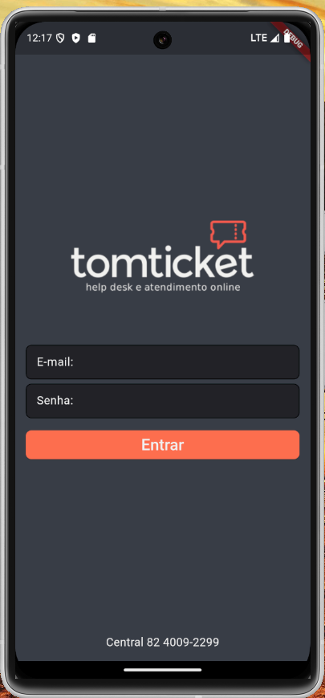
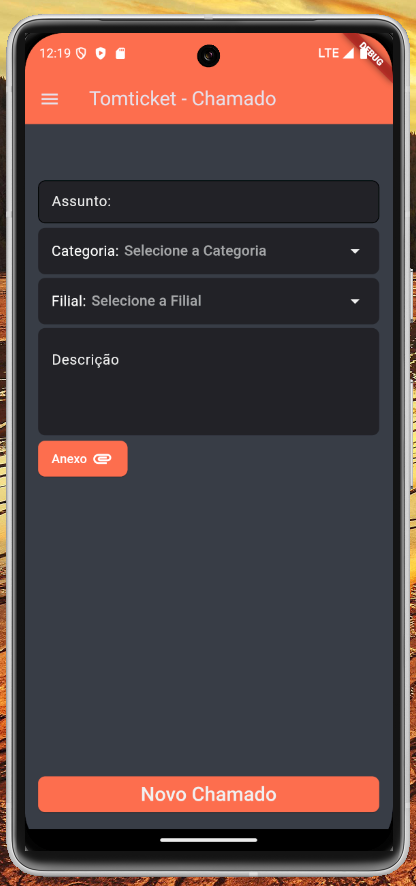

# Sistema de Chamados TomTicket - App Flutter

## Visão Geral

Este é um aplicativo desenvolvido com **Flutter** para facilitar a criação de chamados proativos no sistema **TomTicket**. Seu principal objetivo é agilizar o processo de abertura de chamados durante atendimentos técnicos, garantindo o registro rápido e eficiente das demandas no sistema.

---

## Funcionalidades

### 1. Tela de Login





- Acesso restrito para **usuários autorizados**.
- Verificação de **credenciais** para segurança.
- Redirecionamento para a tela principal após login bem-sucedido.

### 2. Tela de Criação de Chamados (Home)





- Permite criar um chamado proativo de forma rápida e prática.
- Campos disponíveis:
  - **Assunto**: Resumo da demanda ou problema.
  - **Filial**: Local onde o técnico está atuando.
  - **Categoria**: Tipo ou categoria da solicitação.
  - **Descrição**: Detalhamento do chamado.
  - **Anexo**: Permite anexar arquivos e documentos relevantes.
- **Envio rápido**: Após preenchimento, o chamado é registrado no sistema TomTicket, otimizando o tempo do técnico.

---

## Objetivo do Aplicativo

- **Agilidade**: Simplificar o processo de abertura de chamados durante o atendimento, permitindo que o técnico registre a demanda enquanto ainda está no local.
- **Registro eficiente**: Deixar um registro documentado e detalhado do atendimento técnico no sistema.
- **Proatividade**: A ferramenta possibilita a criação de chamados antes mesmo de uma solicitação formal do cliente, assegurando a resolução de problemas de forma preventiva.

---

## Tecnologias Utilizadas

- **Flutter**: Framework para desenvolvimento multiplataforma.
- **TomTicket API**: Integração para registro dos chamados no sistema.
- **Flutter DotEnv**: Carregar configurações e chaves sensíveis a partir de um arquivo `.env`.
- **File Picker**: Para anexar documentos e imagens aos chamados.

---

## Estrutura do Projeto

### Diretórios

- **`/lib`**: Diretório principal do projeto Flutter, contendo o código da aplicação.

  - **`/services`**: Responsável pela configuração e integração com a API, incluindo funções de comunicação e manipulação de dados recebidos.

  - **`/src`**: Estrutura principal do aplicativo, contendo arquivos essenciais e o ponto de entrada (`app`).

    - **`/pages`**: Inclui todas as telas da aplicação, divididas por funcionalidade, como Login, Criação de Chamados, e outras páginas.

    - **`/components`**: Contém componentes reutilizáveis, como campos de entrada de texto, botões personalizados e outros elementos de interface usados em várias partes do aplicativo.

    - **`/data`**: Armazena dados para o login.

    - **`/styles`**: Define estilos padronizados, como cores, fontes e tamanhos, para garantir consistência visual no aplicativo.

---

---

## Configuração e Execução

### Pré-requisitos

1. **Flutter SDK**: Certifique-se de ter o Flutter instalado ([Instruções](https://flutter.dev/docs/get-started/install)).
   ```plaintext
   API_URL="URL do endpoint"
   API_KEY="Sua chave de API TomTicket"
